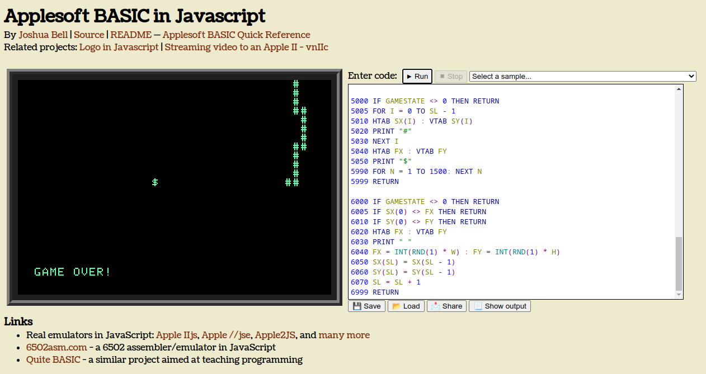

# The Coding Train - AppleSoft Basic Snake Game Challange

How was coding like 40 years ago? In my opinion, besides modern software complexity, modern tools make our life easier. While I was coding this challange, I've missed a lot our modern debuggings tools!

## How to run it?

Copy [this code](./snake.source), paste it [here](https://www.calormen.com/jsbasic/) and click on `Run` button. Use `w`, `s`, `a` and `d` keys to move. Have fun!

## Why do I wrote it?

Curiosity! Thanks, @shiffman!